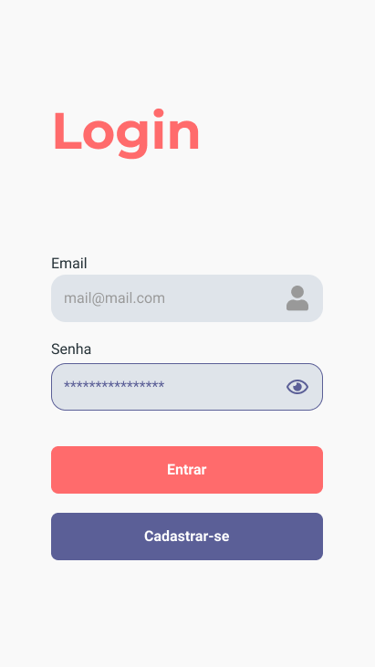

<h1 align="center"> :love_hotel: Helper Mobile </h1>
<h3 align="center">
  Aplicação para doações online
</h3>

---

## :iphone: Algumas telas do app

<p>
    
</p>

<p>
    
</p>

## :construction_worker: Pré-requisitos

- [NodeJS(Preferencialmente a versão 12.18)](https://nodejs.org/en/)
- **[Yarn (opcional)](https://classic.yarnpkg.com/en/docs/install/)**

## :clipboard: Executando o projeto

```bash
# Clone este repositório
$ git clone <https://github.com/gaoliveira21/helper-mobile.git>

# Acesse a pasta do projeto no terminal/cmd
$ cd helper-mobile

# Instalar as dependências
$ yarn # com yarn
$ npm install # com npm

# Iniciando o servidor
$ yarn start # com yarn
$ npm start # com npm

```

## :hammer_and_wrench: Tecnologias utilizadas

- [React Native](https://reactnative.dev/)
- [Expo](https://expo.io/)

---

### :construction_worker: Feito por:

<table>
  <tr>
    <td align="center"><a href="https://github.com/gaoliveira21"><br /><sub><b>Gabriel Oliveira</b></sub></a><br /></td>
    <td align="center"><a href="https://github.com/pedrooV2"><br /><sub><b>Pedro Lucas</b></sub></a><br /></td>
  </tr>
</table>

### :memo: License
Esse projeto está sob MIT license. Veja [LICENSE](https://github.com/gaoliveira21/helper-mobile/blob/main/LICENSE) para mais informações.

---
